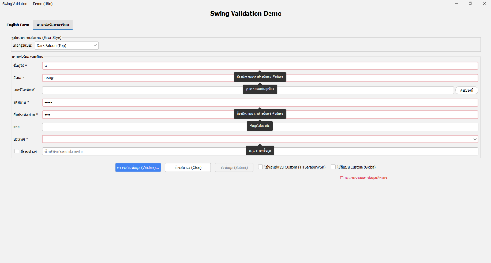

# Swing Validation Library

[](https://www.oracle.com/java/)
[](LICENSE)
[](https://github.com/phonchai/swing-validation)

> [🇺🇸 **Read in English**](#english) | [🇹🇭 **อ่านภาษาไทย**](#thai)

---

<a name="english"></a>

## 🇺🇸 English

A modern, fluent, and comprehensive validation library for Java Swing, designed to work seamlessly with **FlatLaf** and Enterprise applications.

| English Form | Thai Form |
|:---:|:---:|
|  |  |

### Features 🚀

- **Fluent API:** Chain rules easily (`.required().email().minLength(5)`)
- **16 Internal Rules:** Matches standard web framework validation capabilities.
  - Basic: `required`, `minLength`, `maxLength`, `pattern`, `email`
  - Numeric: `number`, `min`, `max`, `integer`, `between`, `digits`
  - Advanced: `url`, `oneOf`, `matches` (cross-field), `custom`
  - Conditional: `requiredWhen`, `when`
- **6 Error Display Styles:**
  - 🎈 **Balloon Tooltip:** Modern, customizable balloons (Dark, Danger, Warning).
  - 📝 **Inline Label:** Text below the field (Bootstrap style).
  - 🟥 **Outline Only:** Simple FlatLaf outline.
  - 🧱 **Bottom Block:** Solid color block attached to the field.
  - ❌ **Trailing Icon:** Error icon inside the text field (FlatLaf native).
  - 🎨 **Composite:** Combine multiple styles (e.g., Icon + Balloon).
- **Enterprise Grade:**
  - **Dynamic Forms:** Add/remove fields at runtime without memory leaks.
  - **Cross-Field Triggers:** Auto-revalidate dependent fields (e.g., Confirm Password).
  - **Extensible:** SPI architecture for custom component support.
- **Internationalization (i18n):**
  - **Locale Support:** Built-in English and Thai (`new Locale("th", "TH")`).
  - **Dynamic Messages:** `validator.field(comp).required()` auto-fetches message based on current Locale.
  - **Global Theming:** Customize fonts and colors project-wide via `UIManager`.

### Installation 📦

#### Using JitPack

1. Add the JitPack repository to your `pom.xml`:
```xml
<repositories>
    <repository>
        <id>jitpack.io</id>
        <url>https://jitpack.io</url>
    </repository>
</repositories>
```

2. Add the dependency:
```xml
<dependency>
    <groupId>com.github.YourUsername</groupId>
    <artifactId>swing-validation</artifactId>
    <version>1.1.0</version>
</dependency>
```

### Usage 💡

#### Basic Validation

```java
FormValidator validator = new FormValidator();

// Simple rule
validator.field(txtUsername).required("Username is required");

// Chained rules
validator.field(txtEmail)
    .required("Email is required")
    .email("Invalid email format");

// Numeric validation
validator.field(txtAge)
    .number("Must be a number")
    .between(18, 60, "Age must be between 18 and 60");
```

#### Enterprise Features

**Cross-Field Matching (Confirm Password):**
```java
validator.field(txtPassword)
    .required("Password is required");

// Automatically re-validates when txtPassword changes
validator.field(txtConfirm)
    .required("Confirm password is required")
    .matches(txtPassword, "Passwords do not match");
```

**Dynamic Forms:**
```java
// Remove a field and its rules/listeners (Safe for memory leaks)
validator.removeField(txtPhone);
```

#### Internationalization & Theming 🌍🎨

**Switching Language:**
```java
// Set Thai language globally
FormValidator.setLocale(new Locale("th", "TH"));

// Use parameterless rules (auto-localized)
validator.field(username).required(); 
```

**Global Customization (One-time setup):**
```java
// Custom Font
UIManager.put("Validation.font", new Font("Kanit", Font.PLAIN, 14));

// Custom Colors
UIManager.put("Validation.background", Color.PINK);
UIManager.put("Validation.foreground", Color.BLACK);
UIManager.put("Validation.borderColor", Color.RED);
UIManager.put("Validation.errorColor", Color.MAGENTA);
```

---

<a name="thai"></a>

## 🇹🇭 ภาษาไทย

ไลบรารีตรวจสอบความถูกต้องของข้อมูล (Validation) สำหรับ Java Swing ที่ทันสมัย เขียนง่าย (Fluent API) และรองรับการทำงานระดับ Enterprise (i18n, Theming)

### คุณสมบัติเด่น 🚀

- **Fluent API:** เขียนโค้ดแบบต่อเนื่อง อ่านง่าย (`.required().email().minLength(5)`)
- **กฎการตรวจสอบ 16 แบบ:** ครอบคลุมการใช้งานทั่วไปและ Web Standard
  - พื้นฐาน: `required`, `minLength`, `maxLength`, `pattern`, `email`
  - ตัวเลข: `number`, `min`, `max`, `integer`, `between`, `digits`
  - ขั้นสูง: `url`, `oneOf`, `matches` (ตรวจสอบข้ามฟิลด์), `custom`
  - เงื่อนไข: `requiredWhen`, `when` (ตรวจสอบเมื่อเงื่อนไขเป็นจริง)
- **รูปแบบการแสดงผล Error 6 แบบ:**
  - 🎈 **Balloon Tooltip:** บอลลูนแจ้งเตือนสไตล์ Modern (ปรับสี, ทิศทางลูกศรได้)
  - 📝 **Inline Label:** ข้อความแจ้งเตือนใต้ช่องกรอกข้อมูล (สไตล์ Bootstrap)
  - 🟥 **Outline Only:** เส้นขอบสีแดง (รองรับ FlatLaf)
  - 🧱 **Bottom Block:** แถบสีด้านล่างฟิลด์
  - ❌ **Trailing Icon:** ไอคอนแจ้งเตือนภายในช่องกรอกข้อมูล
  - 🎨 **Composite:** ผสมผสานหลายรูปแบบได้ (เช่น แสดงทั้ง Icon และ Balloon)
- **ฟีเจอร์ระดับองค์กร (Enterprise Grade):**
  - **Dynamic Forms:** เพิ่ม/ลบ ฟิลด์ระหว่างรันไทม์ได้จริง (จัดการ Memory Leak ให้)
  - **Cross-Field Triggers:** ตรวจสอบฟิลด์ที่เกี่ยวข้องกันอัตโนมัติ (เช่น ยืนยันรหัสผ่าน)
  - **Extensible:** ออกแบบมาให้ขยายต่อได้ง่าย (SPI architecture)
- **รองรับภาษาและธีม (i18n & Theming):**
  - **Locale Support:** รองรับภาษาไทยและอังกฤษในตัว (`new Locale("th", "TH")`)
  - **Dynamic Messages:** ดึงข้อความแจ้งเตือนตามภาษาปัจจุบันให้อัตโนมัติ
  - **Global Theming:** ปรับแก้ Font และสีได้ทั้งโปรเจกต์ผ่าน `UIManager`

### การติดตั้ง 📦

#### ผ่าน JitPack

1. เพิ่ม Repository ในไฟล์ `pom.xml`:
```xml
<repositories>
    <repository>
        <id>jitpack.io</id>
        <url>https://jitpack.io</url>
    </repository>
</repositories>
```

2. เพิ่ม Dependency:
```xml
<dependency>
    <groupId>com.github.YourUsername</groupId>
    <artifactId>swing-validation</artifactId>
    <version>1.0.0</version>
</dependency>
```

### ตัวอย่างการใช้งาน 💡

#### การตรวจสอบพื้นฐาน (Basic Validation)

```java
FormValidator validator = new FormValidator();

// ตรวจสอบค่าว่าง
validator.field(txtUsername).required("กรุณากรอกชื่อผู้ใช้");

// ตรวจสอบอีเมล (เขียนต่อเนื่องได้)
validator.field(txtEmail)
    .required("กรุณากรอกอีเมล")
    .email("รูปแบบอีเมลไม่ถูกต้อง");

// ตรวจสอบตัวเลขและช่วงข้อมูล
validator.field(txtAge)
    .number("ต้องเป็นตัวเลขเท่านั้น")
    .between(18, 60, "อายุต้องอยู่ระหว่าง 18 ถึง 60 ปี");
```

#### ฟีเจอร์ขั้นสูง (Enterprise Features)

**ตรวจสอบรหัสผ่านตรงกัน (Cross-Field Matching):**
```java
validator.field(txtPassword)
    .required("กรุณากรอกรหัสผ่าน");

// จะตรวจสอบใหม่อัตโนมัติเมื่อ txtPassword มีการเปลี่ยนแปลง
validator.field(txtConfirm)
    .required("กรุณายืนยันรหัสผ่าน")
    .matches(txtPassword, "รหัสผ่านไม่ตรงกัน");
```

**ฟอร์มแบบไดนามิก (Dynamic Forms):**
```java
// ลบฟิลด์ออกจากระบบตรวจสอบ (เคลียร์ Listener ให้เอง ปลอดภัย)
validator.removeField(txtPhone);
```

#### การเปลี่ยนภาษาและธีม (Internationalization & Theming) 🌍🎨

**การเปลี่ยนภาษา:**
```java
// ตั้งค่าเป็นภาษาไทยทั้งระบบ
FormValidator.setLocale(new Locale("th", "TH"));

// เรียกใช้กฎโดยไม่ต้องระบุข้อความ (ระบบจะดึงภาษาไทยมาแสดงเอง)
validator.field(username).required(); 
```

**การปรับแต่งธีม (Global Customization):**
ตั้งค่าครั้งเดียวที่ Main ใช้งานได้ทั้งโปรเจกต์
```java
// เปลี่ยนฟอนต์แจ้งเตือน
UIManager.put("Validation.font", new Font("Kanit", Font.PLAIN, 14));

// เปลี่ยนสีแจ้งเตือน
UIManager.put("Validation.background", Color.PINK);       // พื้นหลัง Balloon
UIManager.put("Validation.foreground", Color.BLACK);      // ตัวอักษร Balloon
UIManager.put("Validation.borderColor", Color.RED);       // เส้นขอบ Balloon
UIManager.put("Validation.errorColor", Color.MAGENTA);    // สีตัวอักษร Inline Label
```

---

## License

MIT License
